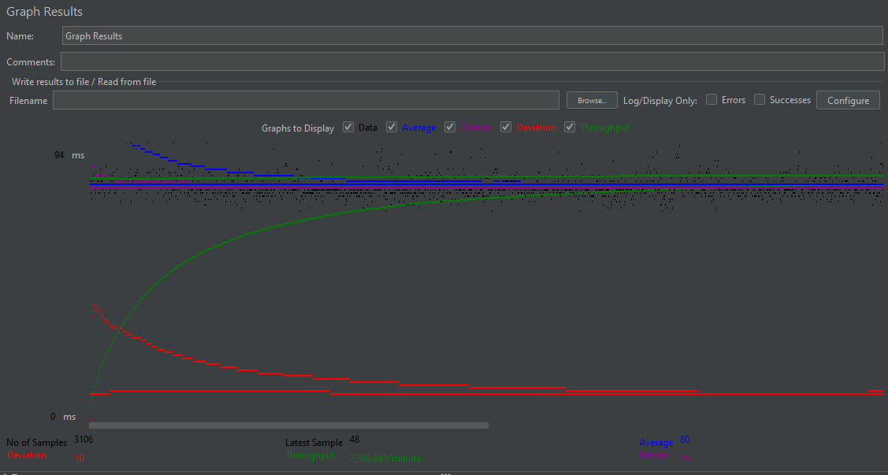
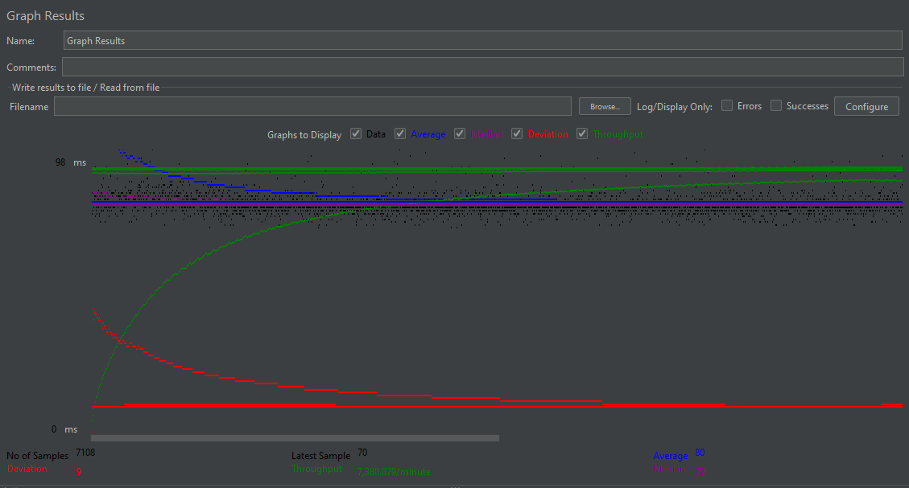

- # General
    - #### Project Name: 122B Bread / Fabflix
    
    - #### Andrea Stefano Polito
    
    - #### Instruction of deployment: Build WAR file with maven then Upload Project5.war file to tomcat manager

- # Connection Pooling
    - #### filename/path of all code/configuration files in GitHub of using JDBC Connection Pooling.
    - WebContent/META-INF/context.xml
    
    - #### How Connection Pooling is utilized in the Fabflix code.
    Connection Pooling is used in all instances when a database connection is established, by using a Datasource
    and initiating "getConnection()" in a try block. This pulls an available connection from the pool of connections,
    and utilizes it until it is closed. With the connection, all JDBC operations such as using statements and
    querying the database are possible.
    
    - #### How Connection Pooling works with two backend SQL.
    With two backend SQL servers, as the apache server delegates connections to each server, connections will begin to
    be established between the two servers, and kept in their own respective pools. In order to ensure that both pools
    have an even amount of connections, connection timeouts are ensures so that new ones will have to be periodically
    established.
    

- # Master/Slave
    - #### filename/path of all code/configuration files in GitHub of routing queries to Master/Slave SQL.
    - WebContent/context.xml
    - src/DashboardServlet
    - src/MoviesServlet
    - balancer_config/000-default.conf

    - #### How read/write requests are routed to Master/Slave SQL?
    The apache server periodically routes requests between the master and slave instances depending on which instance is available.
    Since we want to make sure that reads can happen from both instances, but writes only happen to the master instance,
    We allow both servers to connect to their localhost instances for reads, so that when the load balancer connects to
    one of the servers based on necessity, there will be an even balance of reads to each mysql server as well.
    In the instances where data needs to be written to mysql, we establish a datasource that connects solely to the
    master. If user sales were implemented on this website, that would be an instance where a connection to the master
    datasource is used. It is defined alongside moviedb in context.xml as moviedbMaster, also in web.xml as a resource
    reference. The master connection is used in this implementation on the dashboard servlet, when employees which to
    add a star to the database.
    

- # JMeter TS/TJ Time Logs
    - #### Instructions of how to use the `log_processing.*` script to process the JMeter logs.
    - Put the log_processing.py script in the same directory as the files you wish to process. 
    - Execute the command "python3 log_processing FILES", where you can add as many files as you wish.
    - The log processor will then output the average TS and TJ computed from all of the files collectively.

- # JMeter TS/TJ Time Measurement Report

| **Single-instance Version Test Plan**         | **Graph Results Screenshot**        | **Average Query Time(ms)** | **Average Search Servlet Time(ms)** | **Average JDBC Time(ms)** | **Analysis**                                              |
|-----------------------------------------------|-------------------------------------|----------------------------|-------------------------------------|---------------------------|-----------------------------------------------------------|
| Case 1: HTTP/1 thread                         |     | 89                         | 2.774443831395349                   | 2.098136866279069         | Basic querying of normal single instance                  |
| Case 2: HTTP/10 threads                       |   | 80                         | 2.2049494839021246                  | 1.8876512823567289        | Multiple threads better able to take advantage of pooling |
| Case 3: HTTPS/10 threads                      |  | 81                         | 1.9661784038514443                  | 1.6550388382393397        | Similar to http, more secure access                       |
| Case 4: HTTP/10 threads/No connection pooling |                   | 80                         | 2.7763933240973975                  | 2.3978679359082           | Suffers from no pooling                                   |

| **Scaled Version Test Plan**                  | **Graph Results Screenshot**      | **Average Query Time(ms)** | **Average Search Servlet Time(ms)** | **Average JDBC Time(ms)** | **Analysis**                                                                                         |
|-----------------------------------------------|-----------------------------------|----------------------------|-------------------------------------|---------------------------|------------------------------------------------------------------------------------------------------|
| Case 1: HTTP/1 thread                         |   | 81                         | 2.87385986938349                    | 2.1516356091954023        | Only 1 thread used, so similar results to single instance fabflix                                    |
| Case 2: HTTP/10 threads                       |  | 80                         | 1.8462540430500844                  | 1.4976670384074282        | Performance is significantly better due to better handling of high throughput with the load balancer |
| Case 3: HTTP/10 threads/No connection pooling |         | 80                         | 2.4401738567697                                  | 1.9590735254680018                        | suffers from no pooling                                                                              |
